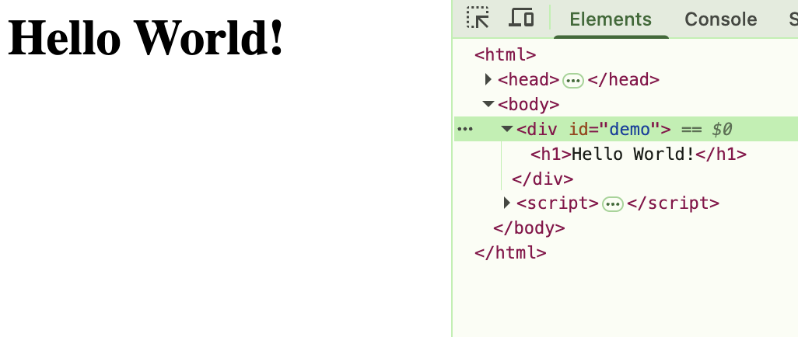

# DOM

This section discuss web pages based on direct DOM manipulation.

## Working Examples

To run the working examples open via a browser the file `index.html` under the `dom` package.

### Bundling

This example demonstrate the offloading of DOM methods to a separate package. Here is the [working example](../dom/bundle/index.html)

### Event

This example demonstrate event handling `onClick`. Here is the [working example](../dom/event/index.html)

### InnerHTML vs OuterHTML

| Feature | innerHTML | outerHTML |
| --- | --- | --- |
| What it gets | HTML content within the element | The entire HTML of the element (including tags) |
| What it sets | Replaces content within the element | Replaces the entire element |
| Element itself | Remains the same after setting | Is replaced after setting |

The [innerHTML example](../dom/inner/index.html) and the result is as follows:

The [outerHTML example](../dom/inner/index.html) and the result is as follows:

### Navigator

This [example](../dom/navigation/index.html) demonstrates technique to access DOM elements.

### Selector

This [example](../dom/selector/index.html) demonstrates technique to query class elements.

## References

* [w3schools HTML DOM](https://www.w3schools.com/js/js_htmldom.asp)